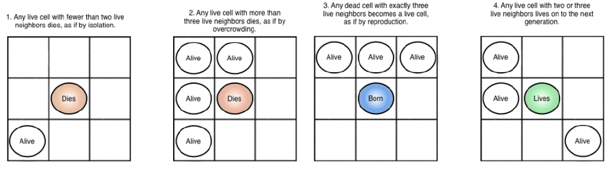

# Game Of Life

The Game of Life was invented in 1970 by the British mathematician John Horton Conway. It is the best-known example of a cellular automaton which is any system in which rules are  applied to cells and their neighbors in a regular grid.

This repository is my PyQt implementation of Conway's Game of Life, that follows the architectural pattern **Model-View-Controller**. 

**Short demo TODO**

## Game of Life Rules

The game is played on a two-dimensional grid (or board). Each grid location is either empty (*Dead* cell) or populated (*Alive* cell) by a single cell. A location’s neighbors are any cells in the surrounding eight adjacent   locations. The simulation of starts from an initial state of populated locations and then progresses through time. The evolution of the board state is governed by a few simple rules:

* each populated location with one or zero neighbors dies (from *loneliness*);
* each populated location with four or more neighbors dies (from *overpopulation*);
* each populated location with two or three neighbors survives;
* each unpopulated location that becomes populated if it has exactly three populated neighbors.

#
## My Implementation

The core part of the game is implemented in [Cell.py](Components/Cell.py), where is implemented the logic of any cells of the Game Of Life universe.

In the [Model](model.py) there are methods for managing data of the application.

The [View](view.py) is the user interface 

The [Controller](controller.py) interprets user interactions in the View and manipulates the Model data.

**TODO: SISTEMA TUTTO IL DISCROSO DEL MVC**

## Functionalities

### Play/Pause evolution and clear the board
l

### Variable framerate
The user can set the framerate of the board evolution with a slider

### Drawing and editing of state
l

### Load/Save board state
l

### Zooming of board
l

### Cell History
l
