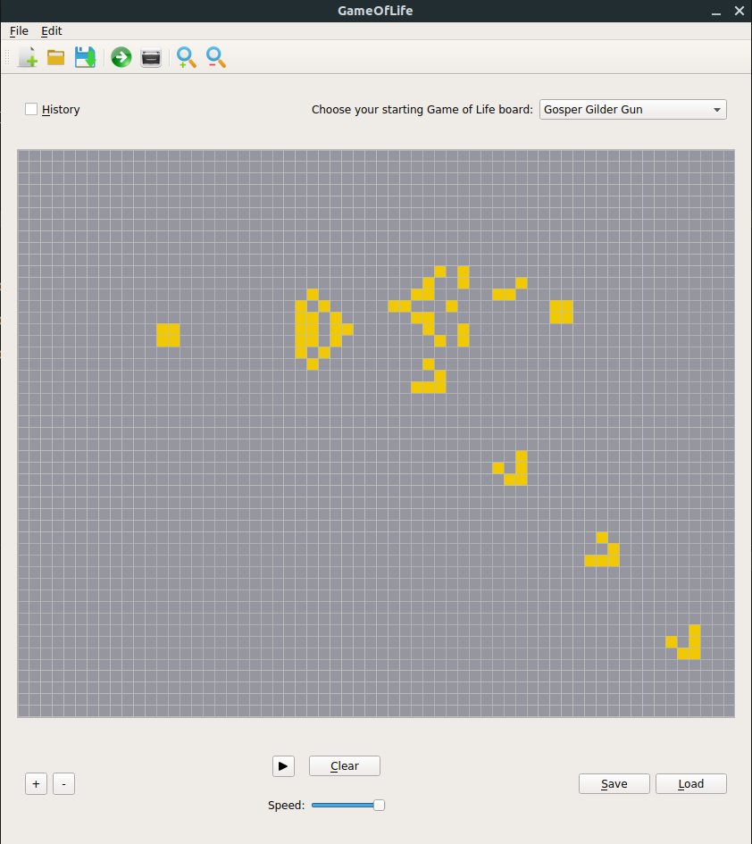

# Game Of Life

The Game of Life was invented in 1970 by the British mathematician John Horton Conway. It is the best-known example of a cellular automaton which is any system in which rules are  applied to cells and their neighbors in a regular grid.

This repository is my PyQt implementation of Conway's Game of Life, that follows the architectural pattern **Model-View-Controller**. 

**Short demo TODO**

## Game of Life Rules

The game is played on a two-dimensional grid (or board). Each grid location is either empty (*Dead* cell) or populated (*Alive* cell) by a single cell. A location’s neighbors are any cells in the surrounding eight adjacent   locations. The simulation of starts from an initial state of populated locations and then progresses through time. The evolution of the board state is governed by a few simple rules:

* each populated location with one or zero neighbors dies (from *loneliness*);
* each populated location with four or more neighbors dies (from *overpopulation*);
* each populated location with two or three neighbors survives;
* each unpopulated location that becomes populated if it has exactly three populated neighbors.

#
## My Implementation

The core part of the game is implemented in [Cell.py](Components/Cell.py), where is implemented the logic of any cells of the Game Of Life universe.

In the [Model](model.py) there are methods for managing data of the application.

The [View](view.py) is the user interface 

The [Controller](controller.py) interprets user interactions in the View and manipulates the Model data.

**TODO: SISTEMA TUTTO IL DISCROSO DEL MVC**

## Functionalities

### Play/Pause evolution and clear the board
The user can always start the evolution of the current Game of Life board. In every moment he can stop the cells' updates both clearing the universe (with the dedicate button) and simply stop it clicking on the appropriate icon. If the user want to see just one update of the grid, he can use the tool bar menu or the Edit menu choosing the Next action.

### Variable framerate
The user can set the framerate of the board evolution with a slider, that choice will affect the speed of the updates.

### Drawing and editing of state
The user can draw or edit the board state. If the interactions are done with left clicks, those will generate new alive cells wither with single clicks or holding down the mouse. In the same way with right clicks the user will clear cells, that are dead.

### Save board state
Every board state can be saved by the user in multiple way: using the button in the bottom or choosing the save action that is in the File menu and in the tool bar menu. If the user select Save As option in the File menu, he can specifies the path where the data has to be saved.

### Choose initial board state
The user can choose the initial state of the board with a saved state or with a Game of Life pattern. Other ways for loading previous state are the button in the bottom, the open action in the tool bar and in the File menu.

### Zooming of board
With the + and - buttons in the right bottom of the application, the user can zoom the board.

### Cell History
Selecting the appropiate check box, the user can observate the last five states of every cells in the board. Alive cells have different color: oldest alive cells got less color intensiry. 
For show just one state's history the user can click on the History action in the tool bar or in the Edit menu. 